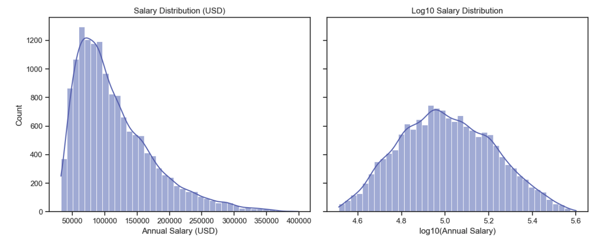

## Project Title:
### Predicting Salaries in the Global AI Job Market Using Machine Learning
___
### 1. Problem Statement
The artificial intelligence (AI) job market has expanded rapidly, producing a wide range of roles, required skill sets, and salary levels. However, AI professionals and employers alike face a lack of transparency regarding how job attributes such as skills, experience, and location influence compensation.

Most job platforms display salary ranges but do not provide data-driven explanations of how these salaries are determined. As a result, professionals struggle to assess their market value, while employers lack benchmarks for competitive compensation.

This project proposes the development of a machine learning–based salary prediction system that estimates compensation for AI-related job roles based on structured job posting data.

Despite the availability of thousands of AI job postings online, there is no straightforward way to predict salary based on job characteristics such as role, skills, experience level, and location. Traditional methods rely on simple averages or anecdotal benchmarks, which fail to capture complex relationships in the data.

This project aims to address this gap by using supervised machine learning models to learn patterns in the AI job market and generate accurate salary predictions.

---

### 2. Model Outcomes or Predictions: 

This project addresses a regression problem using supervised learning techniques. The objective of the model is to predict a continuous numerical outcome, specifically an individual’s annual salary. During model training, salaries are log-transformed to improve numerical stability and model performance, and predictions are subsequently converted back into USD values for interpretation. The dataset includes labeled examples with known salary values, enabling the use of supervised regression algorithms such as linear and tree-based models. The final model output is a predicted salary amount expressed as a continuous variable.

**Learning Paradigm: Supervised Learning**

This project uses **supervised learning** algorithms.

Justification:
- Each observation in the dataset includes:
    - Input features (e.g., job title, experience level, company size, location, remote status)
    - A known target variable (actual salary)
    - The model learns a mapping function from inputs → output by minimizing prediction error against known labels

Because the correct output (salary) is explicitly provided during training, supervised learning is both necessary and appropriate.

**Algorithms Used (Aligned with Learning Type)**

All models implemented in the project are supervised regression algorithms, including:
- Linear Regression (baseline)
- Ridge Regression (regularized linear model)
- Random Forest Regressor
- Gradient Boosting Regressor (Histogram-based)

Each of these models:
- Accepts structured tabular input features
- Produces a continuous numerical prediction
- Is evaluated using regression metrics such as RMSE, MAE, and R²
___

### 3. Data Acquisition
**Data source**
- The dataset used in this project was obtained from Kaggle, a widely used platform for open data and machine learning research.
- The dataset is titled [Global AI Job Market & Salary Trends 2025](https://www.kaggle.com/datasets/bismasajjad/global-ai-job-market-and-salary-trends-2025).
- It contains structured, labeled data suitable for supervised learning.

**Dataset description**
- The dataset includes job-related and organizational features such as job title, experience level, employment type, company size, work setting, geographic location, and annual salary.
- Each record contains a known salary value, enabling regression-based modeling.

- **Rationale for data selection**
- Although multiple data sources were initially considered, this dataset was selected as the sole data source due to:
    - Its relevance to AI-related salary prediction
	- A clearly defined continuous target variable (salary)
	- Sufficient sample size and feature richness
- Using a single, well-curated dataset reduced integration complexity and avoided inconsistencies across sources.
  
**Assessment of data suitability**
- Exploratory data analysis revealed clear relationships between salary and features such as experience level, job role, and company size.
- Salary distributions exhibited strong right skewness, indicating the need for transformation and confirming the dataset’s realism and predictive potential.

**Visualization to support data potential**
- Visualizations such as salary distribution plots, boxplots, and category-based comparisons were used to assess the dataset.
- These visual analyses demonstrated meaningful patterns and variability, confirming that the dataset contains sufficient signal to support regression modeling.

*Figure 1. Distribution of annual salaries in the dataset. The right-skewed shape motivates the use of a log₁₀ transformation.*

**Conclusion**
- The Kaggle dataset Global AI Job Market & Salary Trends 2025 provides high-quality, relevant data for predicting salaries in the AI job market.
- Visual and statistical inspection confirmed its suitability as the sole data source for this project.
___

### 4. Data Preprocessing or Preparation

- **Initial data inspection**
    - Reviewed the single dataset for structure, data types, and completeness.
	- Verified consistency in feature names, categorical values, and salary units.
- **Handling missing values**
	- Removed records with missing or invalid salary values, as the target variable is required for supervised learning.
	- Evaluated feature-level completeness and retained only variables with sufficient data quality.
	- Treated missing values in categorical features as distinct categories during encoding to avoid unnecessary data loss.
- **Addressing inconsistencies and skewness**
	- Standardized categorical variables such as job title, experience level, employment type, company size, and work setting to ensure uniform labeling.
	- Examined the distribution of salary values and identified strong right skew.
	- Applied a log₁₀ transformation to the salary variable to reduce skewness and improve model stability.
- **Feature encoding and preprocessing**
	- Encoded categorical features using one-hot encoding to convert non-numeric variables into a machine-readable format.
	- Passed numerical features through the preprocessing pipeline without scaling where appropriate.
	- Used a column transformer to apply preprocessing steps consistently across feature types.
- **Train–test split**
	- Split the dataset into training and test sets using an 80/20 ratio.
	- Ensured that the test set remained completely unseen during model training and preprocessing.
- **Pipeline integration**
	- Integrated preprocessing and modeling steps into a single pipeline.
	- Prevented data leakage and ensured reproducibility and fair evaluation across all models.

### 5. Modeling

The modeling phase focused on selecting and comparing multiple supervised regression algorithms appropriate for predicting a continuous salary outcome. Model selection was guided by the project’s problem statement, which aims to estimate annual salary based on structured job- and company-related features. Both linear and non-linear models were chosen to balance interpretability, predictive performance, and robustness.

A **Linear Regression** model was implemented as a baseline to establish a simple, interpretable benchmark for performance. This baseline provided insight into linear relationships between features and salary and served as a reference point for evaluating more complex models. To address potential multicollinearity introduced by one-hot encoding of categorical variables, **Ridge Regression** was selected as a regularized extension of the linear model. Ridge regression improves model stability and generalization while retaining coefficient interpretability, making it well-suited for explaining salary drivers.

To capture non-linear relationships and feature interactions that linear models cannot represent, ensemble-based methods were also included. A **Random Forest Regressor** was selected for its ability to model complex patterns, handle mixed feature types, and reduce overfitting through averaging across multiple decision trees. In addition, a **Gradient Boosting Regressor** (Histogram-based) was used to further improve predictive accuracy by sequentially correcting model errors and efficiently handling large datasets.

All models were trained using the same preprocessing pipeline and evaluated on a held-out test set using standard regression metrics. This consistent modeling framework enabled fair comparison across algorithms and supported informed selection of the final model based on performance and interpretability.

### 6. Model Evaluation 

**Type of models considered**
- Supervised regression models were used to predict a continuous salary value.
- Classification and unsupervised learning models were not appropriate for this problem.
  
**Models evaluated**
- Linear Regression (baseline)
- Ridge Regression (selected final model)
- Random Forest Regressor
- Histogram-based Gradient Boosting Regressor

**Evaluation strategy**
- Split the dataset into training and test sets using an 80/20 ratio.
- Applied a consistent preprocessing pipeline across all models to prevent data leakage and ensure fair comparison.

**Evaluation metrics**
- Root Mean Squared Error (RMSE): primary metric for evaluating model performance.
- Mean Absolute Error (MAE): used to assess average prediction error with reduced sensitivity to outliers.
- R-squared (R²): used to measure the proportion of salary variance explained by the model.
  
**Model selection criteria**
- Ridge Regression achieved the lowest RMSE on the test set, indicating the strongest generalization performance.
- MAE and R² values further supported Ridge Regression’s consistency and stability.
- Regularization helped mitigate multicollinearity introduced by one-hot encoding, improving model robustness.

**Final outcome**
- Ridge Regression was selected as the optimal model for this project.
- The model provided the best balance between predictive accuracy, generalization, and interpretability.
- Coefficient-based interpretability enabled clear identification of key salary drivers.
